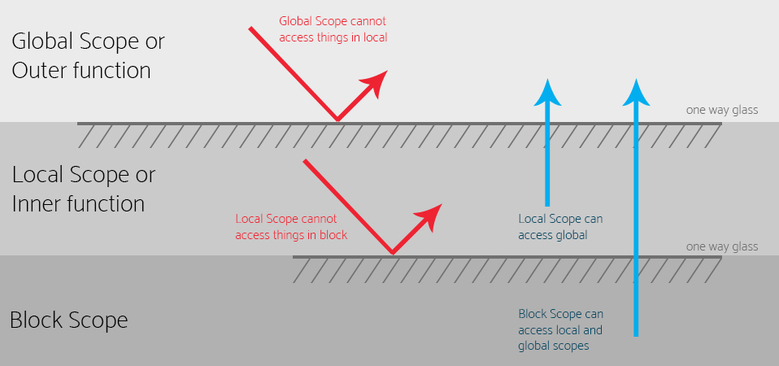

# JavaScript - Back to Basics

## Intro

My name is Jeremy "Jermbo" Lawson. You can find me on Twitter and GitHub @jermbo

I have been in the industry for over 15 years. Started off as a designer and illustrator, then moved to developer a little over 12 years ago.

I host several events and meetups. Palm Beach JavaScript, BocaJS, and Palm Beach FrontEnd Developers.

I help run a non-profit dedicated to teaching kids to code called Code Palm Beach.

I am a FrontEnd Tech Lead and Community Lead at Cognizant Softvision.

Above all, I am a husband and father.

## Who is this course for?

This course is designed to reintroduce you to concepts that you might be using on a daily basis but don't really understand why.

This is targeted towards individuals who have been using JavaScript for one to three years who want to take their knowledge to the next level.

## What to expect?

In each section you will be introduced to a topic, provided a definitions, examples, and end with some exercise.

The exercises are intended to reinforce what was just learned. Please refer to the slides of that section for reference. We will be walking around to offer assistance if needed.

All the code and topics covered will be for native browser implementation. No build tools will be required nor will any server code be created.

While some sections are stand alone to cover the topic at hand, there are sections that utilize topics that were previously explained.

At the end of the lecture, you will have all the information necessary to complete the final project.

## Language Fundamentals

In this portion we will break down some of the fundamentals of the language. One thing I want you to take away is that a lot of this is programming fundamentals. I will do my best to point out the areas that are JavaScript specific and which are just programming basics.

### Variables

A **variable** is a named location in **memory** where **data can be stored**.

It's a **symbolic** name given to a **known**, or **unknown**, quantity that permits the **name to be used independently from the information it holds**.

#### Variable Types

There are three ways to declare a variable.

**var** **let** **const**

_var_ - is the traditional way to declare a variable. This is function scoped and has some unique quirks about it. ( It’s generally best to not use this, unless you have to support older browsers. )

_let_ - introduced in ES6. This is blocked scoped and acts like you expect a normal variable to act. Its main benefit over var is you cannot redeclare a let with the same name.

_const_ - introduced in ES6. This has similar characteristics as let. The main difference is that const cannot be reassigned.

_Note_ General rule of thumb is to use **const** everywhere, only changing to **let** if absolutely necessary.

#### Naming Rules

When **naming** a **variable** there are some rules you need to be aware of.

- Variables can only start with a **letter**, **dollar sign (\$)**, or **underscore (\_)**
- They **cannot** contain a **dash (-)**, a **period (.)**, or a **space ( )**. (This will become more obvious in later sections.)
- They **cannot** be a **reserved word**. Things like **true**, **this**, **class**, etc. (If you see your editor highlight them differently, that is a good sign it cannot be used.)
- The are **case sensitive**. **score** is not the same thing as **Score**.

#### Style Rules

You will run into different styles for naming a variable. Here is a list of common ones you might come across in the wild.

- **Camel Case** is a compound word where the first word is all lowercase, and the first letter of each following word is capitalized. For example; `currentUser` `totalBalance` `playerPositionX` `currentDashboardState`
- **Pascal Case** is a compound word where the first letter of every word is capitalized and the rest are lower cased.
- **Snake Case** is a compound word where all characters are lowercase and each word is separated by an underscore ( \_ ).

Outside the **Naming Rules**, style choices are completely optional. Whichever you choose, be **consistent**. **Consistency** is way more important than any given style.

Choose meaningful names. Code is for you and other humans. It's important to write code as humanly understandable as possible. Avoid abbreviations only you know, or obscure names that don't fit the context of the code you are creating, or creating a name that does not represent the data it's storing.

#### Variable Examples

To define a variable you use the keyword **let** or **const** and give it a name.

```JavaScript
// ----------------
// Good Examples
let userName;
let is_logged_in = false;
let score = 4000;
const PlacesToVisit = ['Florida', 'Ohio', 'California'];
const currentYear = new Date().getFullYear();

let userName = 'Bender'; // Error: variable already exists
currentYear = new Date(); // Error: cannot reassign constants
PlacesToVisit.push('New York'); // ['Florida', 'Ohio', 'California', 'New York']

// ----------------
// Bad Examples
let cliu; // Current Logged In User
const positionX = 'London'; // What's the connection?
const uFavColor = 'Bananas'; // Weird. `u` as in User or UI?
```

#### Var Exercises

In file `01-vars/start/vars.js`, you will see a series of variables that need names. Change the `var` key word to an appropriate `let` or `const` and create meaningful names.

### Functions

Generally speaking, a **function** is a "subprogram" that can be **called** by code external to the function.

A function is composed of a sequence of statements called the **function body**.

Data can be **optionally passed** into a function and a function can **optionally return** data.

There are a couple of different ways to write a function. Here are a some more common ways you will see in the wild.

- Anonymous
- Declaration
- Expression
- Arrow

#### Anonymous

Simply put, an **anonymous** function is a function without a name.

```JavaScript
(function() {
  // do stuff
})();
```

#### Declaration

A **function declaration** is a function with a **name**. These follow very similar naming rules to variables and can be called later in your code by referring to the name provided.

```JavaScript
function addTwo(num1, num2) {
  return num1 + num2;
}
```

#### Expression

A **function expression** is a function where an expression should be. (An expression is the right hand side of the equals sign.)

```JavaScript
const addTwo = function(num1, num2) {
  return num1 + num2;
}
```

#### Arrow

An **arrow function expression** is a syntactically compact alternative to regular functions. They are unique as they do not have their own bindings to `this`, `arguments`, `super` or `new.target` keywords.

Due to the anonymous nature of arrow functions, they must be utilized as an expression or a callback.

A couple of rules to understand are:

1. If one parameter is required, the parentheses are optional. Zero or more than one, they are required.
2. If logic can be completed in one line, curly brackets are optional.
3. If that one line is a `return` statement, the keyword `return` is optional.
   1. This is know as an implicit return statement. The opposite being explicit.

```JavaScript
const addTwo = function (num1, num2) {
  return num1 + num2;
}
```

```JavaScript
const addTwo = (num1, num2) => {
  return num1 + num2;
}
```

```JavaScript
const addTwo = (num1, num2) => num1 + num2;
```

```JavaScript
const square = function(num) {
  return num * 2;
}
```

```JavaScript
const square = (num) => {
  return num * 2
}
```

```JavaScript
const square = (num) => num * 2;
```

```JavaScript
const square = num => num * 2;
```

#### Invoke

In order to get a block of code to run, the function needs to be **invoked**. Other synonyms include; **call**, **trigger**, **run**.

All you have to do to **run** a function is **refer to it via its name along with a pair of parentheses**.

```JavaScript
addTwo(2,5);
```

#### Parameters / Arguments

**Parameters** are a set of **variables** that will affect how your function runs. You **define parameters** when you create your function by adding a **comma separated list** of names that represent the value they will **eventually hold**.

**Arguments** are what you **pass into** the function to alter the outcome. **Arguments** match **one to one** the parameter list.

```JavaScript
function divideTwo(numOne, numTwo) {
  return numOne / numTwo;
}

function cubeMe(num) {
  return num * num * num;
}

console.log( divideTwo(10, 5) );
console.log( cubeMe(4) );
```

```JavaScript
function divideTwo(10, 5) {
  return numOne / numTwo;
}

function cubeMe(4) {
  return num * num * num;
}

console.log( divideTwo(10, 5) );
console.log( cubeMe(4) );
```

```JavaScript
function divideTwo(10, 5) {
  return 10 / 5;
}

function cubeMe(4) {
  return 4 * 4 * 4;
}

console.log( divideTwo(10, 5) );
console.log( cubeMe(4) );
```

```JavaScript
function divideTwo(10, 5) {
  return 2;
}

function cubeMe(4) {
  return 64;
}

console.log( divideTwo(10, 5) );
console.log( cubeMe(4) );
```

```JavaScript
function divideTwo(10, 5) {
  return 2;
}

function cubeMe(4) {
  return 64;
}

console.log( 2 );
console.log( 64 );
```

#### Callback

A **callback** is a function that is **passed** as an **argument**.

All **callbacks** are **functions**. But not all **functions** are **callbacks**.

Only when a **function** is passed as an **argument** is when it is known as a **callback**.

##### CB Example Alert

```JavaScript
function greetUser (cb, userName) {
  cb('Hello ' + userName);
}

greetUser (alert, 'Jermbo');
```

```JavaScript
function greetUser (alert, 'Jermbo') {
  cb('Hello ' + userName);
}

greetUser (alert, 'Jermbo');
```

```JavaScript
function greetUser (alert, 'Jermbo') {
  alert('Hello ' + 'Jermbo');
}

greetUser (alert, 'Jermbo');
```

##### CB Example Anonymous

```JavaScript
function greetUser (cb, userName) {
  cb('Hello ' + userName);
}

greetUser (function (msg) {
  console.log(msg);
}, 'Jermbo');
```

```JavaScript
function greetUser (function, 'Jermbo') {
  cb('Hello ' + userName);
}

greetUser (function (msg) {
  console.log(msg);
}, 'Jermbo');
```

```JavaScript
function greetUser (function, 'Jermbo') {
  function('Hello ' + 'Jermbo');
}

greetUser (function (msg) {
  console.log(msg);
}, 'Jermbo');
```

```JavaScript
function greetUser (function, 'Jermbo') {
  function('Hello ' + 'Jermbo');
}

greetUser (function ('Hello Jermbo') {
  console.log(msg);
}, 'Jermbo');
```

```JavaScript
function greetUser (function, 'Jermbo') {
  function('Hello ' + 'Jermbo');
}

greetUser (function ('Hello Jermbo') {
  console.log('Hello Jermbo');
}, 'Jermbo');
```

##### CB Example Declaration

```JavaScript
function greetUser (cb, userName) {
  cb('Hello ' + userName);
}
function logStuff (msg) {
  console.log(msg);
}
greetUser(logStuff, 'Jermbo');
```

```JavaScript
function greetUser (logStuff, 'Jermbo') {
  cb('Hello ' + userName);
}
function logStuff (msg) {
  console.log(msg);
}
greetUser(logStuff, 'Jermbo');
```

```JavaScript
function greetUser (logStuff, 'Jermbo') {
  logStuff('Hello ' + 'Jermbo');
}
function logStuff ('Hello Jermbo') {
  console.log(msg);
}
greetUser(logStuff, 'Jermbo');
```

```JavaScript
function greetUser (logStuff, 'Jermbo') {
  logStuff('Hello ' + 'Jermbo');
}
function logStuff ('Hello Jermbo') {
  console.log('Hello Jermbo');
}
greetUser(logStuff, 'Jermbo');
```

#### Default Parameters

Often times, the function parameters do not require them to be passed during invocation, but the argument still needs a value. Parameters can be set to a default value and used in the absence of an argument being passed.

```JavaScript
function makeCoffee( type, additions ) {
  return `Your ${type} with ${additions.join(' ')} is ready. Enjoy!`;
}
console.log( makeCoffee('coffee', [] ));
// Your coffee with is ready. Enjoy!
console.log( makeCoffee('latte', ['cream', 'sugar'] ));
// Your latte with cream sugar is ready. Enjoy!
```

```JavaScript
function makeCoffee( type = 'coffee', additions = [] ) {
  return `Your ${type} with ${additions.join(' ')} is ready. Enjoy!`;
}
console.log( makeCoffee() );
// Your coffee with is ready. Enjoy!
console.log( makeCoffee('latte', ['cream'] ) );
// Your latte with cream is ready. Enjoy!
console.log( makeCoffee(undefined, ['cream'] ) );
// Your coffee with cream is ready. Enjoy!
console.log( makeCoffee('cold brew') );
// Your cold brew with is ready. Enjoy!
```

```JavaScript
function makeCoffee( type = 'coffee', additions = [], cb = display ) {
  cb(`Your ${type} with ${additions.join(' ')} is ready. Enjoy!`);
}
function display(coffee) {
  console.log(coffee);
}
makeCoffee('cold brew', ['cream']);
makeCoffee(undefined, undefined, (coffee) => {
  console.log('Anonymous CB', coffee)
});
```

#### Function Exercise

In file `02-functions/start/functions.js`, you will see a series of functions that need names and parameters. Remember, function names follow very similar rules to variables.

### Scope

**Scope** determines the visibility or accessibility of a variable or function of your code. There are four scopes in JavaScript.

- Global
- Local
- Function
- Block



#### Global

JavaScript has one global scope, **window**. Anything that is not written inside a local, function, or block scope can be accessed and altered by any scope in your code.

```JavaScript
// Global Scope
const character = 'Bender';
console.log(character); // "Bender"

function getCharacter() {
  // Local Scope 1
  console.log(character); // "Bender"
}

gerCharacter();
```

#### Local

When declaring a variable inside a function, you are declaring it in a **local scope**. Every function creates its own scope, so declaring the same variables in different functions will not cause issues.

```JavaScript
// Global Scope
const mainMessage = 'Welcome to the Future!';

function UserInterface() {
  // Local Scope 1
  const user = 'Professor';

  function logUser() {
    // Local Scope 2
    const now = new Date();
    console.log(user + ' was logged at ' + now);
    // Professor was logged at 5:15pm
  }

  logUser();
}

// Global Scope
function NonUserInterface() {
  // Local Scope 3
  const user = 'Zap';
  console.log(user); // Zap
}

UserInterface();
```

#### Function

Variables declared inside a function are in it's scope and cannot be access outside that function.

```JavaScript
function scoped() {
  // Function Scope
  const inside = 'Yep, I am inside scope';
  console.log(inside); // "Yep, I am inside scope"
}
scoped();
// Global Scope
console.log(inside); // Reference Error: inside is not defined.
```

#### Block

Introduced in ES6, a **block scope** is the area within curly brackets. Typically within an **if**, or **switch**, or **loops** are considered blocks.

> `let` and `const` are block scoped variables.

```JavaScript
function futurama() {
  // Function Scope
  const isAwesome = true;
  if(isAwesome) {
    // Block Scope
    var character1 = 'Fry';
    let character2 = 'Bender';
    const character3 = 'Leela';
  }

  console.log(character1); // "Fry"
  console.log(character2); // Reference Error: character2 not defined
  console.log(character3); // Reference Error: character3 not defined
}
```

#### Comparison Table

|                              | var      | let   | const |
| ---------------------------- | -------- | ----- | ----- |
| reassigned                   | yes      | yes   | no    |
| Scope                        | function | block | block |
| Reference before declaration | yes      | no    | no    |

### Objects

**Objects** are a set of **key:value** pairs. You can associate objects with real world items.

For example, a **vehicle** is an **object**. All vehicles have the same **properties** and **methods**, but the values **differ between different vehicle**.

Another example would be a **person**. A person has properties such as; **firstName**, **lastName**, **email**. A person also has methods like; **eat**, **rest**, **speak**.

```JavaScript
const myCar = {
  model: 'I-280', make: 'Izuzu',
  year: 2011, color: 'Black',
  transmission: 'standard', numberOfWheels: 4,
  accelerate: () => {
    // make car go faster
  },
  decelerate: () => {
    // make car go slower
  },
  addFuel: (type, amount) => {
    // add fuel of type to tank.
  }
}
```

```JavaScript
const person = {
  firstName: "John", lastName: "Doe",
  health: 50, energy: 47,
  fullName: function() {
    return `${this.firstName} ${this.lastName}`;
  },
  sleep: function() {
    this.health = 100;
    return this.health;
  },
  eat: function(type) {
    if (type == "fruit") {
      this.energy += 25;
    } else {
      this.energy += 10;
    }
    return this.energy;
  }
};

console.log(person.fullName()); // John Doe
console.log(person.eat('pizza')); // 57
console.log(person.eat('fruit')); // 82
console.log(person.health); // 50
console.log(person.sleep()); // 100
```

#### Properties and Methods

**Properties** are like a variable, they store a value. Your car might have a different make, so your cars **make property** will reflect accordingly.

**Methods** are like functions, they do something. Again, since your car is different, the type and amount of fuel you require will be different.

_Note_ **Properties** are **variables**, just associated with an **object**.

_Note_ **Methods** are **functions**, just associated with an **object**.

#### Dot Notation

There are **two** ways to access a property or method of an object. The first way is use the **dot notation**.

```JavaScript
console.log( myCar.make ); // Izuzu
console.log( myCar.year ); // 2011
myCar.accelerate(); // "going faster"
```

#### Bracket Notation

The second way to access properties or methods is by using the **bracket notation**.

```JavaScript
console.log( myCar['make'] ); // Izuzu

const prop = 'year';
console.log( myCar[prop] ); // 2011

const method = 'accelerate';
myCar[method](); // "going faster"
```

#### Bracket Notation Use Case 1

There are two use cases that would require you to use the bracket notation over the dot notation. The first, most straight forward reason, is the object key has a space or character not allowed in a variable name.

```JavaScript
// Completely acceptable keys in an object
const special = {
  'Key One': 'The First Value',
  'Key-ID': 1234,
  'the.func': () => { console.log('the func') }
};

// Incorrect
console.log(special.Key One);
// Cannot access a key with a space
console.log(special.Key-ID);
// Cannot access a key with a dash
console.log(special.the.func);
// Cannot access a key with a dot

// Correct
console.log(special['Key One']); // "The First Value"
console.log(special['Key-ID']); // 1234
console.log(special['the.func']); // "the func"
```

#### Bracket Notation Use Case 2

The second use case is accessing an item based on user input.
Let's say we have an interface that allows the user to change the values of each property on their car. We have a **keyInput** select that maps to each property in the object. When the user selects it, it will reflect the property chosen and allow the user to change the value.

```JavaScript
const userKey = keyInput.value;
const userValue = valInput.value;

myCar[userKey] = newValue;
```

### Strings

A **string** is any set of characters **between quotes**, either single or quotes.

You can use either at any time, just be aware **what you start with you must end with**.

```JavaScript
console.log('hello'); // String Literal

const userName = "Bender";
console.log( userName ); // "Bender"
```

#### Concatenation

**Concatenation** is the operation of joining character strings end-to-end.

```JavaScript
console.log('Futur' + "ama"); // "Futurama"

const sport = "Blitz";
const type = 'ball';
console.log( sport + type ); // "Blitzball"
```

#### Template Literals

**Template Literals** are string literals allowing embedded expressions. This supports **string interpolation** as well as **multi-line** strings.

```JavaScript
const num1 = 4;
const num2 = 2;
console.log(`${num1} + ${num2} = ${num1 + num2}`); // "4 + 2 = 6"
```

```JavaScript
const user = {
  first: "Phillip",
  last: "Fry"
};
console.log(`${user.first} ${user.last}`); // "Phillip Fry"
```

```JavaScript
const posts = [
  { title: "post 1", desc: "this is a desc" },
  { title: "post 2", desc: "this is a desc2" },
];

const postsHTML = posts.map((post, index) => {
  return `<article id="post-${index}>
    <h1>${post.title}<h1>
    <div>${post.title}<div>
  </article>`;
}).join('');
```

_Note_ Pretty much everything can be thought of as an object in JavaScript. **String** is no exception, as this has a set of **properties** and **methods** associated with them.

#### Length Property

We can tell how many characters are in a string by accessing its **length** property.

_Note:_ spaces and other hidden characters are valid characters and will contribute to the length.

```JavaScript
console.log( " Hello world!   ".length ); // 16
const userName = "Bender";
console.log( userName.length ); // 6

if( userName.length > 5 ){
  console.log(`Username is ${userName.length} characters long`);
  // "Username is 6 characters long"
}
```

#### toUpperCase

**.toLowerCase()** returns the calling string converting every alpha character to lowercase.

This is extremely useful when validating user input and data you may have an a database.

```JavaScript
const greeting = ' HellO HuMAn    ';
console.log( greeting.toLowerCase() ); // " hello human    "
```

#### toLowerCase

**.toUpperCase()** returns the calling string converting every alpha character to uppercase.

Another tool to ensure consistency when trying to validate strings.

```JavaScript
const greeting = ' HellO HuMAn    ';
console.log( greeting.toUpperCase() ); // " HELLO HUMAN    "
```

#### trim

**.trim()** removes any **leading** and **trailing** whitespace from the string.

**Whitespace** in this context is all invisible characters that add space to your string. **Space**, **tab**, **no-break space**, and all line terminator characters.

```JavaScript
const greeting = ' HellO HuMAn    ';
console.log( greeting.trim() ); // "HellO HuMAn"
```

#### Chainable

Most methods in JavaScript are **chainable**, meaning you can keep adding methods to the end of the line and the value will be passed into each sequentially.

```JavaScript
const greeting = ' HellO HuMAn    ';
console.log( greeting.trim().toLowerCase() ); // "hello human"
```

#### split

**.split()** turns the string into an **array of string** by separating the string into strings.

How it's broken up is determined by the **separator string** provided as the **argument**.

```JavaScript
const date = "10-26-1997"; // Marlins first world series win
console.log( date.split('-') ); // ["10", "26", "1997"]

const name = "Bender Bending Rodriguez";
console.log( name.split(' ') ); // ["Bender", "Bending", "Rodriguez"]

const secretCode = "IMG:abcdefg:101010D:!@#$%^&*()";
console.log( secretCode.split(':') ); // ["IMG", "abcdefg", "101010D", "!@#$%^&*()"]
```

### Numbers

Currently, JavaScript has only **one type** of number. **Numbers** can be written **with** or **without** decimals and can be either **positive** or **negative**.

```JavaScript
const age = 123;
const height = -5.5;
const pi = 3.141;

console.log(age); // 123
console.log(height); // -5.5
console.log(pi); // 3.141
console.log(123e5); // 12300000
console.log(123e-5); // 0.00123
```

#### parseInt

**.parseInt()** takes a string argument and returns an integer.

This method will convert the string to a whole number, regardless of decimals that might exist. If non-number characters are encountered they will be ignored and terminate the rest of parse at first sign.

```JavaScript
const age = '123';
const height = '5.5';
const pi = '3.141';
const test1 = '123abc123';
const test2 = 'abc123';

console.log( parseInt(age) ); // 123
console.log( parseInt(height) ); // 5
console.log( parseInt(pi) ); // 3
console.log( parseInt(test1) ); // 123
console.log( parseInt(test2) ); // NaN
```

#### parseFloat

**.parseFloat()** takes a string argument and returns a decimal integer.

If alpha characters will be ignored and will terminate the rest of that parse at first sign.

```JavaScript
const age = '123';
const height = '5.5';
const pi = '3.141';
const test1 = '123.456abc123';
const test2 = 'abc123.456';

console.log( parseInt(age) ); // 123
console.log( parseInt(height) ); // 5.5
console.log( parseInt(pi) ); // 3.141
console.log( parseInt(test1) ); // 123.456
console.log( parseInt(test2) ); // NaN
```

_Note_ When pulling **anything** from an input field, it will be a **string**. Use either method when dealing with numerical user input.

#### toFixed

**.toFixed()** formats a number to a desired decimal length. This method requires the desired decimal length as its only argument.

```JavaScript
const price = 23;
const numOne = 4;
const numTwo = 7;

console.log( price.toFixed(2) ); // "23.00"
console.log( numOne / numTwo ); // 0.5714285714285714
console.log( (numOne / numTwo).toFixed(4) ); // "0.5714"
```

### Coercion

**Coercion** is a way to change an entity from one **datatype** to **another**.

This is a controversial topic in JavaScript. Is this a flaw in the language? Is that a feature that should be embraced? Is it a little of both?

My stance is, it's a useful tool that should be embraced. It's one of my favorite things about the language, until it isn't.

```JavaScript
console.log( 10 + "10" ); // "1010"
console.log( "5" + 15 ); // "515"
console.log( 5 - "2"); // 3
console.log( "20" - "10"); // 10
console.log(['Hello', 'World'] + ['Glad', 'to', 'be', 'alive']); // "Hello,WorldGlad,to,be,alive"
console.log([6] - 2); // 4
console.log(['yes', 'yes'] - ['yall']); // NaN
console.log([5] * 10); // 50
console.log('50' / 10); // 5
```

Notice all the arithmetic operations kinda work as expected, except for one.

This is because the symbol used for addition is the same symbol used for concatenation.

As JavaScript developers we **run into this all the time**. When we get to the logic section, we will see how this plays out in a different way.

### Arrays

Consider the following code.

```JavaScript
const name1 = 'Fry';
const name2 = 'Leela';
const name3 = 'Bender';
const name4 = 'Professor';
const name5 = 'Hermies';
```

Creating variables is fine, but this can get out of hand quickly. Are you going to create a new variable for every character on that show? How would you search or sort them? How would you add or remove some programmatically?

Short answer, you can't. This is where arrays come into play.

**Arrays** are used to store **multiple values** in a **single variable**.

Let's reconsider the previous example as an array.

```JavaScript
const characters = ['Fry', 'Leela', 'Bender', 'Professor', 'Hermies'];
```

You can access any item in the array by pointing it via its **index number**.

_Note_ Array indexing starts a **zero**. The **first index** in the array reflects the **second item**.

#### Array Methods

As most things in JavaScript, **Arrays** are object like. Meaning, we have access to a set of **properties** and **methods** to interact with the data.

We can break down each Array method into three categories.

- Accessors
- Iterators
- Muators

#### Accessors

These sets of methods **do not modify** the original array, instead they **return** some representation of the array in use.

There are a dozen or so methods, but we are going to explore the ones I tend to use most frequently in day to day work.

##### includes

**.includes()** determines wether an array **includes the provided element**, returning **true** or **false** where appropriate.

```JavaScript
const characters = ['Fry', 'Leela', 'Bender', 'Professor', 'Hermies'];

console.log( characters.includes('Fry') ); // true
console.log( characters.includes('fry') ); // false
console.log( characters.includes('Professor') ); // true
console.log( characters.includes('Zapp') ); // false
```

##### indexOf

**.indexOf()** returns the **first index** at which the provided element can be found in the array. If nothing is found, a **-1** will be returned.

```JavaScript
const characters = ['Fry', 'Leela', 'Bender', 'Professor', 'Hermies'];

console.log( characters.indexOf('Fry') ); // 0
console.log( characters.indexOf('fry') ); // -1
console.log( characters.indexOf('Professor') ); // 3
console.log( characters.indexOf('Zapp') ); // -1
```

##### join

This method **joins** all the elements of an array into a **string**, separating the values by the provided **string separator**, and defaults to commas if not provided.

```JavaScript
const characters = ['Fry', 'Leela', 'Bender', 'Professor', 'Hermies'];

console.log( characters.join() ); // "Fry,Leela,Bender,Professor,Hermies"
console.log( characters.join(' ') ); // "Fry Leela Bender Professor Hermies"
console.log( characters.join('--') ); // "Fry--Leela--Bender--Professor--Hermies"
```

##### slice

This method returns a **shallow portion** of an array into a **new array**, selected from a **starting index** to an **ending index**, ending index not included.

```JavaScript
const characters = ['Fry', 'Leela', 'Bender', 'Professor', 'Hermies'];

console.log( characters.slice(1, 4) ); // ["Leela", "Bender", "Professor"]
console.log( characters.slice(2, 2) ); // []
console.log( characters.slice(0, 3) ); // ["Fry", "Leela", "Bender"]
```

#### Iterators

**Iterators** are a set of methods that **cycle through each item** in an array and **perform the action specified in the callback**.

There are a dozen or so methods one has access to, but we are going to explore ones that I use most frequently in my day to day work.

_Note:_ Each callback will be passed these three arguments, regardless if they are used or not. **CurrentValue**, **index**, **Original Array**.

##### forEach

**.forEach()** **executes** a provided function once for **each element** in the array.

```JavaScript
const characters = ['Fry', 'Leela', 'Bender', 'Professor', 'Hermies'];

characters.forEach( ( character ) => {
  console.log( character );
});
```

##### map

**.map()** creates a **new array** with the results from the callback on every element in the array.

```JavaScript
const numbers = [1,2,3,4];
const doubles = numbers.map(x => x * 2);
console.log( numbers ); // [1,2,3,4]
console.log( doubles ); // [2,4,6,8]
```

```JavaScript
const todos = [
  { id: 1, name: 'Wake up', completed: true },
  { id: 2, name: 'Drink Coffee', completed: true },
  { id: 3, name: 'Code JavaScript', completed: false },
  { id: 4, name: 'Drink more coffee', completed: false }
];
const todoNames = todos.map(todo => todo.name);
console.log( todoNames ); // ["Wake up", "Drink Coffee", "Code JavaScript", "Drink more coffee"]
```

##### filter

**.filter()** creates a **new array** with all the elements that **pass the test** in the provided callback.

```JavaScript
const characters = ['Fry', 'Leela', 'Bender', 'Professor', 'Hermies'];
const longNames = characters.filter(character => character.length > 5 );
console.log( characters );  // ["Fry", "Leela", "Bender", "Professor", "Hermies"]
console.log( longNames ); // ["Bender", "Professor", "Hermies"]
```

```JavaScript
const todos = [
  { id: 1, name: 'Wake up', completed: true },
  { id: 2, name: 'Drink Coffee', completed: true },
  { id: 3, name: 'Code JavaScript', completed: false },
  { id: 4, name: 'Drink more coffee', completed: false }
];
const stillTodo = todos.filter(todo => !todo.completed );
console.log( stillTodo );
// [{completed: false, id: 3, name: "Code JavaScript"},
// {completed: false, id: 4, name: "Drink more coffee" }]
```

#### Mutators

**Mutators** are a set of methods that **change the original array** and **returns** the information what was changed.

There are a dozen or so methods we have access to, but we are going to explore ones I use most frequently in my day to day.

##### Pop

**.pop()** removes one item from the end of the array. Once the item is removed, it will return the element and change the length of the array.

```JavaScript
const characters = ['Fry', 'Leela', 'Bender', 'Professor', 'Hermies'];

console.log( characters.pop() ); // "Hermies"
console.log( characters ); // ["Fry", "Leela", "Bender", "Professor"]
```

##### Push

**.push()** adds items to the end of an array. You can pass multiple items, separated by commas. Once the item(s) is added, the new length will be returned.

```JavaScript
const characters = ['Fry', 'Leela', 'Bender', 'Professor', 'Hermies'];

console.log( characters.push('Zapp') ); // 6
console.log( characters ); // ["Fry", "Leela", "Bender", "Professor", "Hermies", "Zapp"]
```

##### Shift

Similarly to the pop method, **.shift()** removes an item from the beginning of the array. This also returns the item that has been removed as well as modifies the length of the array.

```JavaScript
const characters = ['Fry', 'Leela', 'Bender', 'Professor', 'Hermies'];

console.log( characters.shift() ); // "Fry"
console.log( characters ); // ["Leela", "Bender", "Professor", "Hermies"]
```

##### Unshift

Similarly to the push method, **.unshift()** will add an item to the beginning of an array. You can pass multiple items, separated by commas. Once the item(s) is added, the new length will be returned.

```JavaScript
const characters = ['Fry', 'Leela', 'Bender', 'Professor', 'Hermies'];

console.log( characters.unshift('Zapp') ); // 6
console.log( characters ); // ["Zapp", "Fry", "Leela", "Bender", "Professor", "Hermies"]
```

##### Splice

**.splice()** changes the contents of an array by removing existing items and or adding new ones.

Splice at bare minimum accepts one argument, which represents the starting index. If the second argument is not provided, it will remove the rest in the array after that starting index.

```JavaScript
const characters = ['Fry', 'Leela', 'Bender', 'Professor', 'Hermies'];

console.log(characters.splice(1,3)); // ["Leela", "Bender", "Professor"]
console.log(characters); // ["Fry", "Hermies"]
console.log(characters.splice(1, 0, 'Leela', 'Bender', 'Professor')); // []
console.log(characters); // ["Fry", "Leela", "Bender", "Professor", "Hermies"]
console.log(characters.splice(3)); // ["Professor", "Hermies"]
console.log(characters); // ["Fry", "Leela", "Bender"]
```

### Looping

Loops are a way to do something repeatedly. Typically these are used to access each item in an array, but they have other use cases as well.

#### while loops

A **while** loop executes its statements as long as a specified condition evaluates to true.

```JavaScript
let i;
let text = '';

while( i < 10 ) {
  text += `The number is ${i}`;
  i++;
}
```

_Note:_ While loops are easy to create **infinite** loops. Use with caution and always remember to create a flag that will evaluate to false, eventually.

```JavaScript
const characters = ['Fry', 'Leela', 'Bender', 'Professor', 'Hermies'];
let i = 0;
let output = '';

while ( characters[i] ) {
  output += `<p>${characters[i]}</p>`;
  i++;
}

document.body.innerHTML = output;
```

#### For Loops

A **for** loop repeats until a specified condition evaluates to false.

```JavaScript
for( let i = 0; i < 10; i++ ) {
  console.log(`The number is ${i}`);
}
```

There are **4 steps** that execute when a for loop runs.

1. The `initialExpression` is executed. ( That's the `let i = 0` part. )
2. The `condition` gets evaluated. ( That's the `i < 10` part. )
   - If the condition is evaluated to true, move to step 3.
   - If the condition is evaluated to false, the loops terminates.
3. The statement executes the block. ( The block being the stuff between the `{}`. )
4. The `incrementExpression` is executed. ( That's the `i++` part. )

```JavaScript
const characters = ['Fry', 'Leela', 'Bender', 'Professor', 'Hermies'];
let output = '';

for ( let i = 0; i < characters.length; i++ ) {
  output += `<p>${characters[i]}</p>`;
}

document.body.innerHTML = output;
```

#### For...in Loops

A **for...in** statement loops through the properties of an object.

```JavaScript
const myCar = {
  make: 'Izuzu',
  model: 'i280',
  year: '2011'
};

for (let key in myCar) {
  console.log(`${key} --> ${myCar[key]}`);
}
```

#### For...of Loops

A **for...of** statement iterates over the values in an **iterable**.

```JavaScript
const paragraphs = document.querySelectorAll('p');

for( let p of paragraphs ) {
  console.log(p.innerText);
}
```

```JavaScript
const name = 'Jermbo'; // Also an Iterable Object

for( let char of name ) {
  console.log(char);
}
```

_Note_: **Iterable** is an object that can be looped over. Arrays, Strings, Maps, Sets, and NodeList.

### Comparisons and Conditions

In any programming language we need a way to compare things to each other.

Due to the fact JavaScript is **not** a **strongly typed** language we have **two ways to compare** items. Either **loosely** or **strongly**.

#### == vs ===

**Equality** can be compared by using **double equal signs**. ( == ). The equality checks the **Left Hand Side (LHS)** as being the same value as the **Right Hand Side (RHS)**. Type is not considered.

**Strict Equality** can be compared by using **triple equal signs** ( === ). The strict equality checks the **LSH** as being the **same type** as the **RHS**, then for the **value equality**.

```JavaScript
const userName = 'Jermbo';

console.log( 1 == 1 ); // true
console.log( 1 == '1'); // true
console.log( 10 == 100 ); // false
console.log( 'Hello' == 'hello'); // false, case sensitivity applies here
console.log( userName == 'Jermbo'); // true
console.log( true == 1 ); // true
console.log( false == 0); // true

console.log( 10 === '10'); // false
console.log( true === 1 ); // false
console.log( false === 0); // false
```

#### != vs !==

**Inequality** returns true if the operands are **not equal** to each other.

To check for inequality you use the **exclamation mark and equal sign** ( != ). This compares for inequality **regardless** of type.

**Strict inequality** compares just the same, though **type** is considered **first**, then inequality.

```JavaScript
const userName = 'Jermbo';

console.log( 1 != 1 ); // false
console.log( 1 != '1'); // false
console.log( 10 != 100 ); // true
console.log( 'Hello' != 'hello'); // true
console.log( userName != 'Jermbo'); // false
console.log( true != 1 ); // false
console.log( false != 0); // false

console.log( 10 !== '10'); // true
console.log( true !== 1 ); // true
console.log( false !== 0); // true
```

#### > vs <

Each **relational operator** will call the `valueOf()` method on **each operand** before the comparison is made.

**Greater than** ( > ) operator returns **true** if the LHS is **greater than** the RHS.

Conversely, **less than** ( < ) will return **true** if the LHS is **less than** the RHS.

```JavaScript
const userName = 'Jermbo';

console.log( 1 > 1 ); // false
console.log( 1 > '1'); // false
console.log( 10 > 100 ); // false
console.log( 'Hello' > 'hello'); // false
console.log( userName > 'Jermbo'); // false
console.log( true > 1 ); // false
console.log( false > 0); // false
```

```JavaScript
const userName = 'Jermbo';

console.log( 1 < 1 ); // false
console.log( 1 < '1'); // false
console.log( 10 < 100 ); // true
console.log( 'Hello' < 'hello'); // true
console.log( userName < 'Jermbo'); // false
console.log( true < 1 ); // false
console.log( false < 0); // false
```

#### >= vs <=

**Greater than** or **equal to** ( >= ) operator returns **true** if the LHS is **greater than** or **equal to** the RHS.

Conversely, **less than** or **equal to** ( <= ) will return **true** if the LHS is **less than** or **equal to** the RHS.

```JavaScript
const userName = 'Jermbo';

console.log( 1 >= 1 ); // true
console.log( 1 >= '1'); // true
console.log( 10 >= 100 ); // false
console.log( 'Hello' >= 'hello'); // false
console.log( userName >= 'Jermbo'); // true
console.log( true >= 1 ); // true
console.log( false >= 0); // true
```

```JavaScript
const userName = 'Jermbo';

console.log( 1 <= 1 ); // true
console.log( 1 <= '1'); // true
console.log( 10 <= 100 ); // true
console.log( 'Hello' <= 'hello'); // true
console.log( userName <= 'Jermbo'); // true
console.log( true <= 1 ); // true
console.log( false <= 0); // true
```

#### Logic Operators

There are countless situations where we need **multiple values** to be true in order to execute some come. Or **only one condition** out of a set of possible conditions needs to be true.

**And** ( && ). **Or** ( || ).

##### And Operator

**And** operator evaluates to true if all conditions evaluate to true.

For example, only display a message that the account balance is low when; user is logged in **and** balance is less than one hundred dollars.

```JavaScript
const isLoggedIn = true;
const balance = 500;

if( isLogged && balance < 100 ){
    console.log( `Greetings. Your low limit balance has been triggered. Your
     balance is currently $${balance}.`);
}
```

##### Or Operator

**Or** operator evaluates to true if one condition evaluate to true.

For example, display a special user score animation if; the user sets a new high school **or** game is over.

```JavaScript
let playerScore = 1000;
let currentHighScore = 2000;
let stillPlaying = false;

if( !stillPlaying || playerScore > currentHighScore ) {
  console.log( playerScore ); // 1000
}
```

### The DOM

**DOM** stands for **Document Object Model**. Think of this as a representation to the markup that defines a page.

JavaScript provides us with a plethora of **methods** that gives us **access** to the HTML for **manipulation**.

#### Select Elements

There are five ways to select an element from the DOM. We will cover two in depth, but will mention all of them incase you run into them in the wild.

- .getElementById()
- .getElementsByClassName()
- .getElementsByTagName()
- .querySelector()
- .querySelectorAll()

#### querySelector()

**querySelector()** is a method on the Document object which returns the first **Element** that matches the specified selector. If no matches are found, `null` is returned.

The specified selector is any valid css selector.

```HTML
<div id='infoArea'>
   <p>Some text about something</p>
   <a class="btn" href="#">Click Me</a>
   <input type=”text” />
</div>
```

```JavaScript
document.querySelector('#infoArea');
// looking for one element with that id
document.querySelector('p');
// looking for the first paragraph on the page
document.querySelector('[type=”text”]');
// looking for the first text input field on the page
document.querySelector('.btn');
// looking for the first class of btn
```

#### querySelectorAll()

**querySelector()** is a method on the Document object which returns a static **NodeList** representing a list of the document's elements that match the specified selector.

```HTML
<div id='infoArea'>
   <p>Some text about something</p>
   <a class="btn" href="#">Click Me</a>
   <input type=”text” />
</div>
```

```JavaScript
document.querySelectorAll('#infoArea');
// looking for all elements with that id.
// ( This is bad practice as ids should be unique, but it can be done. )
document.querySelectorAll('p');
// looking for all the paragraphs on the page
document.querySelectorAll('[type=”text”]');
// looking for all the text input fields on the page
document.querySelectorAll('.btn');
// looking for all items with class of btn on the page
```

#### Caching the DOM

Looking through the DOM is an expensive task. Meaning, process to execute it is high. We can mitigate a bit by **caching** the DOM.

That simply means, store it in a variable for later use.

```JavaScript
const postData = [{...},{...},{...},{...}];

postData.forEach((post, i) => {
  document.querySelector('.posts').innerHTML += `<div class="post post-${i}>
    <h1>${post.title}</h1>
    <div>${post.desc}</div>
  </div>`;
});
```

```JavaScript
const postDisplay = document.querySelector('.post');
const postData = [{...},{...},{...},{...}];

postData.forEach((post, i) => {
  postDisplay.innerHTML += `<div class="post post-${i}>
    <h1>${post.title}</h1>
    <div>${post.desc}</div>
  </div>`;
});
```

#### Properties on the DOM

Every element selected comes with a set of properties and methods. Each property and method can be accessed by simply invoking the property name. Most properties can be overwritten simply by assigning it to a new value.

```HTML
<p id="userName" class="title">
  <span>Jermbo</span>
</p>
```

```JavaScript
const nameDisplay = document.querySelector('#userName');
console.log(nameDisplay.innerHTML); // <span>Jermbo</span>
console.log(nameDisplay.innerText); // Jermbo
console.log(nameDisplay.classList.contains('title')); // true
nameDisplay.classList.add('special');
nameDisplay.addEventListener('mouseover', () => console.log('hello'));
```

_Link:_ Checkout the [MDN](https://developer.mozilla.org/en-US/docs/Web/API/Element) documentation for a full list of properties and methods.

### Events

JavaScript is an **event based language**. Meaning, nothing happens until something is triggered.

When you are browsing the web, your browser registers different types of events. It's the browsers way of saying, "Hey! This just happened. Do something if you want.", and your script can respond to that.

_Link_ The browser has a huge list of events that you can listen for. Take a look at [MDN Event Reference](https://developer.mozilla.org/en-US/docs/Web/Events) for a complete list.

_Link_ Checkout the [w3Schools](https://www.w3schools.com/jsref/dom_obj_event.asp) documentation for a full list of events.

#### Types of Events

There are a handful of types of events to listen for.

- Mouse Events
- Touch Events
- Keyboard Events
- Form Events
- Window Events

##### Mouse Events

The **Mouse Event** interface represents events that occur due to the user interacting with a pointing device. Some events often used;

- mousedown
- mouseup
- click
- dblclick
- mouseover
- mouseout
- mousemove
- mousewheel

##### Touch Events

The **Touch Event** interface represents an event sent when the state of contacts with a touch-sensitive surface changes. This surface and be a touch screen or a trackpad. Some events often used;

- touchstart
- touchend
- touchmove
- touchcancel

##### Keyboard Events

The **Keyboard Event** interface describes a user interaction with a keyboard. Each event describes a key and provides an event object with useful information to be utilized. Some events often used;

- keydown
- keypress
- keyup

##### Form Events

The **Form Event** interface describes a user interaction with a form element. Some events often used;

- focus
- blur
- change
- submit

##### Window Events

The **Window Event** interface describes a user interaction with a window of a browser. Some evens often used;

- scroll
- resize
- haschange
- load
- unload

#### Add Event Listener

To set up an event listener, you need to attach it to something. This can be a DOM element, the document, or the window itself.

**.addEventListener()** accepts **two arguments**. The first is what you are listening for, the **eventType**. The second is what you want to do when that event happens, the **callback**.

```JavaScript
window.addEventListener('keypress', (e) => {
  console.log(e.keyCode);
});

document.querySelector('#header').addEventListener('mouseover', (e) => {
  e.target.classList.add('hovered')
});

const items = document.querySelectorAll('.items');
items.forEach(item => item.addEventListener('click', handleItemClick));

function handelItemClick(e) {
  const parent = e.target;
  parent.classList.add('clicked');
  const title = parent.querySelector('h1');
  title.innerText += ' clicked';
}
```

#### Remove Event Listener

**.removeEventListener()** method removes an event handler that has been registered with the `.addEventListener()` method.

_Note:_ In order to remove an event handler, the function specified with `.addEventListener()` **must be an external, name function**. Trying to remove an anonymous function will not work.

```JavaScript
const click1 = document.querySelector(".click1");
const click2 = document.querySelector(".click2");

click1.addEventListener("click", function(e) {
  console.log("anonymous func");
});

click2.addEventListener("click", externalFunc);

function externalFunc(e) {
  console.log("external func");
}

click1.removeEventListener("click", () => {}); // Still active
click2.removeEventListener("click", externalFunc); // Removed click event
```

#### Event Object

Different Events have different information associated with them. Every event that is triggered will generate an **Event Object** and will be passed to the function that executes when the event is triggered.

```JavaScript
document.addEventListener('keypress', function(e) {
  console.log(e.key);
});

const btn = document.querySelector('.btn');
btn.addEventListener('click', function(e) {
  e.preventDefault();
  console.log(e.target.innerText);
});
btn.addEventListener('mouseenter', function(e) {
  console.log(`x: ${e.clientX} - y: ${e.clientY}`);
})
```

## Advanced Topics

### JSON

JSON stands for **JavaScript Object Notation**.

JSON is a lightweight data-interchange format that a lot of api's use to communicate. It's easy to read and write and is used practically anywhere.

JSON is a subset of JavaScript and there are stricter rules on its syntax.

#### Rules

- Uses key/value pairs
  - { "key": "value" }
- Double quotes around the key.
- Data types include
  - String ( using double quotes )
  - Number
  - Boolean
  - Array
  - Object
- File extension **.json**
- MIME type is **application/json**
- Separate everything with commas
  - Last item cannot contain an ending comma.

```JavaScript
{
  "meetups": [
    {
      "name": "Palm Beach JavaScript",
      "organizers": ["Jermbo", "Damian"],
      "members": 608,
      "isActive": true,
      "date": "Last Tuesday of every month"
    },
    {
      "name": "BocaJS",
      "organizers": ["Damian"],
      "members": 826,
      "isActive": true,
      "date": "First Tuesday of every month"
    }
  ]
}
```

#### JSON Parse and Stringify

Since JSON is a subset of JavaScript, if you want to use it you might have to convert it from JSON to an object that JavaScript can utilize.

On the flip side, if you want to save an object to a JSON api, you need to convert it to a JSON object.

JavaScript provides two methods to help.

`JSON.parse` and `JSON.stringify()`

#### Demystifying

Often times, when dealing with data sets, they idea of looking at a complicated set of dots and square brackets can make things looks more scary than they really are. One approach I take is to look at the individual sections, determine what it is, then make a decision on what to do next.

For example, let's figure out what the second ingredient of the third beer in the [BeerApi](https://punkapi.com/documentation/v2).

Lets look at this data from the api, [https://api.punkapi.com/v2/beers?per_page=10](https://api.punkapi.com/v2/beers?per_page=10)

```JavaScript
fetch('https://api.punkapi.com/v2/beers?per_page=10')
  .then(resp => resp.json())
  .then(data => {
    console.log(data); // (10) [{...},{...},{...},...]
    console.log(data[2].ingredients['malt'][1].name); // Wheat Malt
  })
```

### Destructuring

**Destructuring** provides a more succinct way to unpack values from arrays, or properties from objects, into distinct variables. These can be used as stand alone variables, or a part of function parameters.

```JavaScript
console.clear();
const startArr = ['Fry', 'Bender', 'Leela', 'Professor'];
const [person1, person2] = startArr;
console.log( person1 ); // Fry
console.log( person2 ); // Bender

function doSomething ( [ p1, p2, p3 ] ){
    console.log( p1 ); // Fry
    console.log( p2 ); // Bender
    console.log( p3 ); // Leela
    console.log( p4 ); // Reference Error: p4 is not defined
}
doSomething(startArr);
```

```JavaScript
const startObj = {
    name: 'Fry',
    occupation: 'Delivery Boy',
    age: 1025
};
const {name, occupation} = startObj;
console.log( name ); // Fry
console.log( occupation ); // Delivery Boy

function doSomething( { name, occupation, age } ) {
  console.log( name ); // Fry
  console.log( occupation ); // Delivery Boy
  console.log( age ); // 1025
}

doSomething( startObj );
```

### Spread

**Spread syntax** allows an iterable to be expanded in places where zero or more arguments are expected.

```JavaScript
const total = (a, b, c) => a + b + c;
const numbers = [2, 4, 6];
console.log( total(...numbers) ); // 12
console.log( total(numbers) ); // NaN
```

### Rest

**Rest Parameters** allows you to represent an indefinite number of arguments as an array. You can specify any number of parameters and follow the rest at the end of the list. This will always be at the end of the parameter list and will not include the items defined before it.

```JavaScript
function multiply(multiplier, ...theNums) {
  return theNums.map(num => multiplier * num);
}

const nums = multiply(2, 1, 2, 3, 4);
console.log(nums); // [2, 4, 6, 8]
```

### Promise

The **Promise** object represents the eventual completion, or failure, of an asynchronous operation and its resulting value.

```JavaScript
function makeCoffee(type = 'coffee', additions = []) {
  return new Promise((resolve, reject) => {
    setTimeout(() => {
      resolve(`Your ${type} is ready with ${additions.join(' ')}. Enjoy!`);
    }, 1000);
  });
}

makeCoffee('coffee', ['cream', 'sugar'])
  .then(coffee => {
    console.log(coffee);
    return makeCoffee('latte', ['skim milk', 'stevia']);
  })
  .then(coffee => {
    console.log(coffee);
    return makeCoffee('cold brew', ['hazelnut creamer', 'stevia', 'instant espresso shot']);
  })
  .then(coffee => {
    console.log(coffee);
  });
```

### Fetch API

The **Fetch API** is a promised based API that provides an interface for interacting asynchronously with resources across the network. This is similar to what AJAX offers, with a modern differences.

#### CRUD

**CRUD** is a term used to simplify how one interacts with an API or DataBase. CRUD stands for **Create**, **Read**, **Update**, **Delete**.

With any given action, there are associated **HTTP Verbs**.

- Create — POST
- Read — GET
- Update — PUT/PATCH
- Delete — DELETE

#### Put vs Patch

There are two ways to update a document. Put and Patch. The goal of each one is to update an existing record with new information. The difference being, PUT replaces everything with exactly what is sent. Where as PATCH will update the corresponding fields.

```JavaScript
// Record in database to start
{
  id: 1,
  userName: 'Bender',
  email: 'bender@bender.com',
  species: 'Robot'
}

// PUT
{
  id: 1,
  userName: 'Bender2999';
}

// Record in database after update
{
  id: 1,
  userName: 'Bender2999'
}
```

```JavaScript
// Record in database to start
{
  id: 1,
  userName: 'Bender',
  email: 'bender@bender.com',
  species: 'Robot'
}

// PATCH
{
  id: 1,
  userName: 'Bender2999';
}

// Record in database after update
{
  id: 1,
  userName: 'Bender2999',
  email: 'bender@bender.com',
  species: 'Robot'
}
```

_Note_ There is a lot to dive into with Fetch API, let's jump right into examples.

```JavaScript
// Simple GET from API
fetch('https://jsonplaceholder.typicode.com/users')
  .then(resp => resp.json())
  .then(data => {
    console.log(data); // (10) [{...},{...},{...},...]
  });
```

```JavaScript
// Add User to the data
fetch("https://jsonplaceholder.typicode.com/users", {
  headers: { "Content-Type": "application/json; charset=utf-8" },
  method: "POST",
  body: JSON.stringify({
    username: "Elon Musk",
    email: "elonmusk@gmail.com"
  })
})
  .then(resp => {
    console.log(resp);
    return resp.json();
  })
  .then(data => {
    console.log(data);
    // { id: 11, username: "Elon Musk", email: "elonmusk@gmail.com" }
  });
```

```JavaScript
fetch("https://jsonplaceholder.typicode.com/users/3", {
  headers: { "Content-Type": "application/json; charset=utf-8" },
  method: "PUT",
  body: JSON.stringify({
    username: "Elon Musk",
    email: "elonmusk@gmail.com"
  })
})
  .then(resp => resp.json())
  .then(data => {
    console.log(data);
    // { id: 2, username: "Elon Musk", email: "elonmusk@gmail.com" }
  })
  .catch(err=> { console.log(err) });
```
